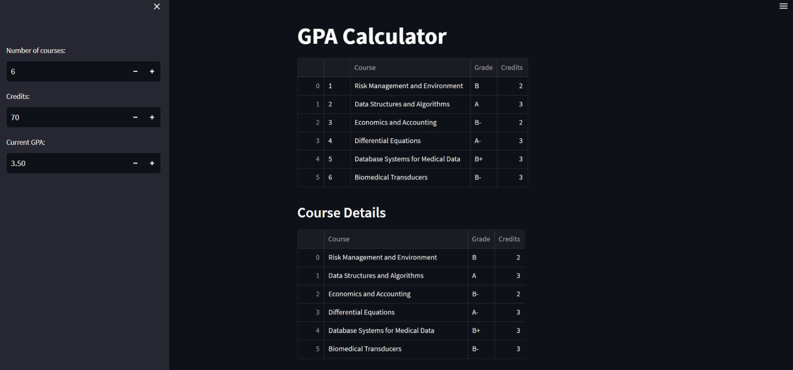
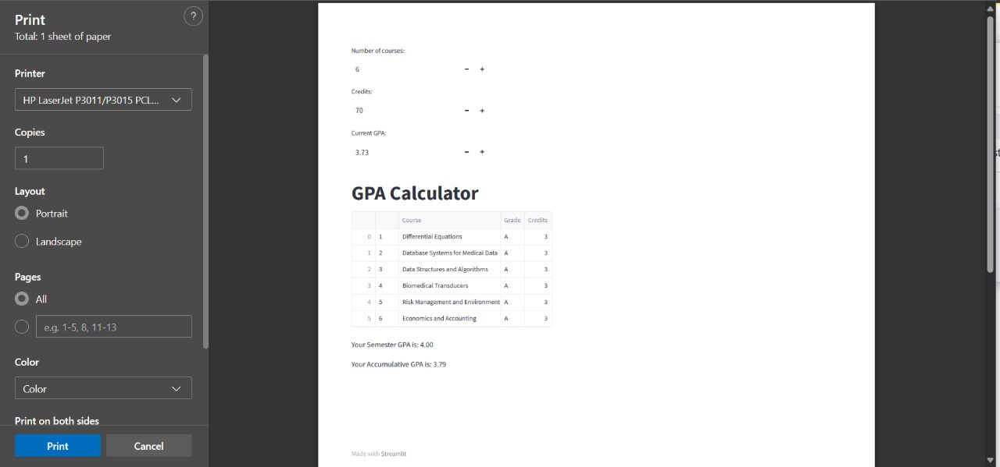
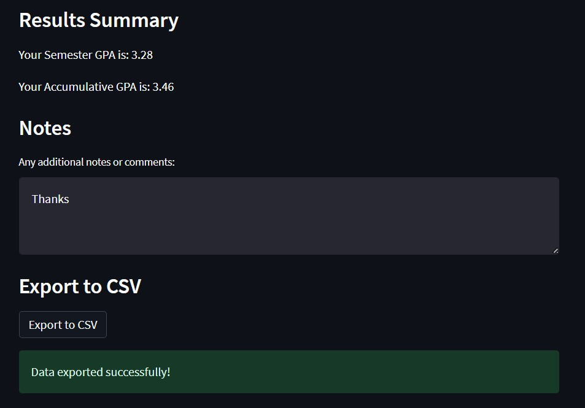

# GPA Calculator

## Description
The application provides a user-friendly interface to calculate both semester and accumulative GPAs. Users can input details such as the number of courses, credits, and grades for each course. The GPA is then automatically computed, considering the credit hours of each course and the corresponding letter grades.

## Overview
This Python-based GPA Calculator, developed using Streamlit, provides a seamless way to calculate both semester and accumulative GPAs. It includes an interactive data editor, automatic letter grade to GPA conversion, and warnings for data accuracy.





## Features

- **User-Friendly Interface:** Dynamic Streamlit interface for easy interactions.
  
- **Interactive Data Editor:** Edit course details with an intuitive data editor.
  
- **Letter Grade to GPA Conversion:** Automatically converts letter grades to precise GPA values.

- **Accurate GPA Computation:** Computes Semester and Accumulative GPAs with precision.

- **Integrated Warnings:** Provides warnings to ensure accurate data input.

## Usage

1. **Clone the Repository:**
   ```bash
   git clone https://github.com/MMansy19/GPA-Calculator-Streamlit
   cd gpa-calculator

2. **Install Dependencies:**
   ```bash
   pip install pandas streamlit
   ```

3. **Run the Application:**
   ```bash
   streamlit run gpa_calculator.py
   ```

4. **Input Details:**
   - Number of courses.
   - Credits for each course.
   - Current GPA.

5. **View Results:**
   - Instantly view Semester and Accumulative GPAs.


## Contributing

Feel free to explore, contribute, or customize this calculator according to your preferences. Let's make GPA calculations a breeze!

## License

This project is licensed under the [MIT License](LICENSE).

---

Happy Coding! 🚀
